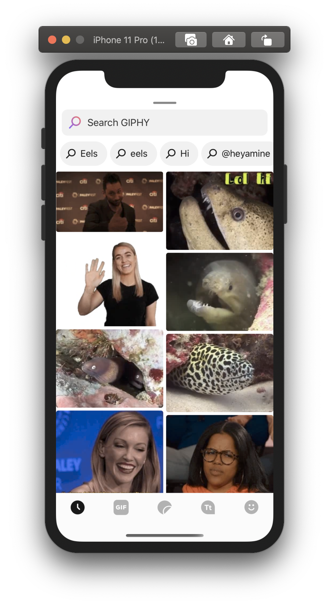
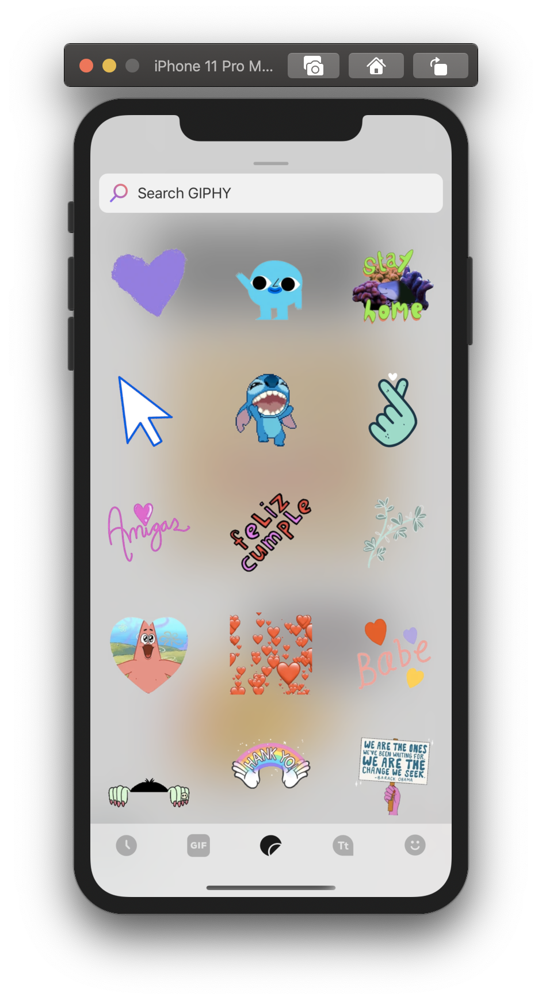
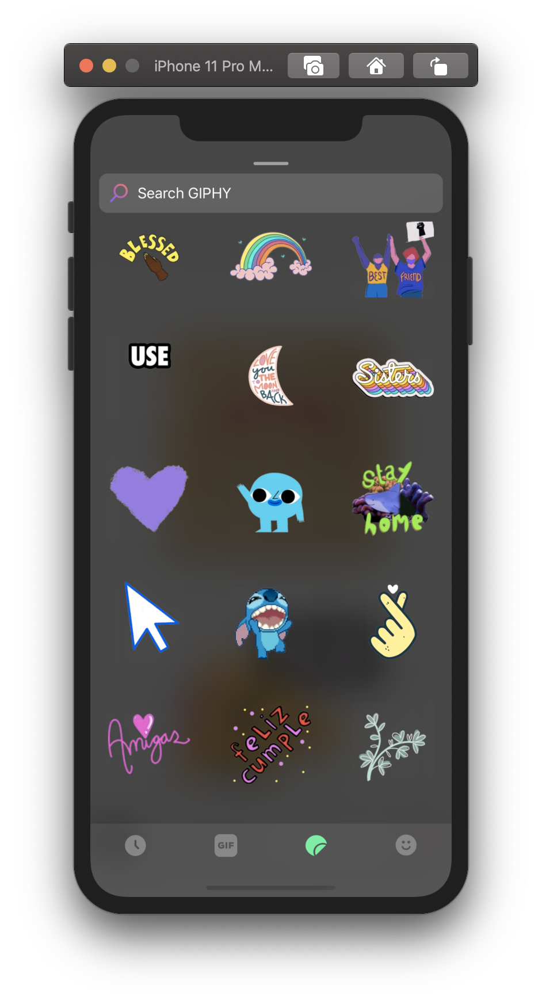

# GIPHY SDK for iOS
 

## _Table of contents_
**Setup**
- [Requirements](#requirements) 
- [CocoaPods](#cocoapods)  
- [Swift Package Manager](#swift-package-manager)
- [Carthage](#carthage)  

- [API Key](#configure-your-api-key) <br>
- [Customization](#custom-ui)  

**Templates**
- [GiphyViewController](#giphyviewcontroller)
- [Settings](#template-settings)
    - [Media Types](#media-types)  
    - [Theme](#theme) 
- [GiphyDelegate](#events)

**GPHMedia**
- [Accessing Media Assets](#accessing-media-assets)
- [GPHMediaView](#gphmediaview)
- [Sharing and Storing](#sharing-and-storing) 

**Caching & Dependencies** 
- [Caching](#caching)
- [Dependencies](#dependencies)

**The Grid**
- [GiphyGridController](#grid-only-and-the-giphygridcontroller-setup)
- [Presentation](#giphygridcontroller-presentation) 
- [GPHContent](#giphygridcontroller-gphcontent)
- [GPHGridDelegate](#giphygridcontroller-gphgriddelegate)

**Clips (GIFs with Sound!) + Animated Text Creation**
- [Clips](https://github.com/Giphy/giphy-ios-sdk/blob/main/clips.md) 
- [Animated Text Creation](https://github.com/Giphy/giphy-ios-sdk/blob/main/animate.md) 
 

### Requirements 
- iOS 13.0 or later   
- A Giphy API key from the [Giphy Developer Portal](https://developers.giphy.com/dashboard/?create=true). 
- Xcode 12 and later  

### Github Example Repo 
- Run the example app to see the GIPHY SDK in action with all of its configurations. Run `pod install` and set your API key [here](https://github.com/Giphy/giphy-ios-sdk-ui-example/blob/master/Swift/Example/ViewController.swift#L113) before building the example app. 
- Open [issues or feature requests](https://github.com/Giphy/giphy-ios-sdk-ui-example/issues)  
- View [releases](https://github.com/Giphy/giphy-ios-sdk-ui-example/releases)

### CocoaPods

Add the GiphyUISDK to your Podfile like so: 

```swift  
target "YourAppTarget" do 
pod 'Giphy' 
end
```
**Note**: for pure Objective-C projects, add an empty swift file to your project and choose `Create the Bridging Header` when prompted by Xcode. This allows static libraries to be linked.

### Swift Package Manager  

Add a new Swift Package to your app linking this repo (`https://github.com/Giphy/giphy-ios-sdk`).
Swift Package Manager is supported for versions 2.1.3 and later.

### Carthage 

We are currently unable to distribute the GIPHY SDK through Carthage. If you are using Carthage, simply drag `GiphyUISDK.xcframework` into your project. 

You will also have to add [webp support](https://github.com/SDWebImage/libwebp-Xcode) to your project.
 
### Configure your API key 

First things first, be sure to import: 
```swift
import GiphyUISDK 
```

Configure your API key. Apply for a new __iOS SDK__ key [here](https://developers.giphy.com/dashboard/). Please remember, you should use a separate key for every platform (Android, iOS, Web) you add our SDKs to.
```swift
Giphy.configure(apiKey: "your ios sdk key here")
```

## Custom UI

We offer two solutions for the SDK user interface - pre-built templates which handle the entirety of the GIPHY experience, and a [Grid-Only implementation](https://developers.giphy.com/docs/sdk#grid) which allows for endless customization.  

See [customization](https://developers.giphy.com/docs/sdk#grid) to determine what's best for you.
 
_Skip ahead to [Grid-Only section](#grid-only-and-the-giphygridcontroller-setup)_

### GiphyViewController 

Create a new `GiphyViewController`, which takes care of most of the magic.  
```swift
let giphy = GiphyViewController()
```

Create a new `GiphyViewController` every time you want to show GIPHY (maintaining a reference to the same `GiphyViewController` object isn't necesssary and can impact performance and lead to unexpected results) 

## Template Settings
 
### _Media Types_

Set the content type(s) you'd like to show by setting the `mediaTypeConfig` property, which is an array of `GPHContentType`s.
 
```swift
giphy.mediaTypeConfig = [.gifs, .stickers, .text, .emoji]
```
Objective-C: 
```Objective-C
[giphy setMediaConfigWithTypes: [[ NSMutableArray alloc] initWithObjects: 
@(GPHContentTypeGifs), @(GPHContentTypeStickers), @(GPHContentTypeText), @(GPHContentTypeEmoji), nil ] ]; 
```
### _Recently Picked_

As of `v1.2.5`, you can add an additional `GPHContentType` to the `mediaTypeConfig` array: `.recents`


```swift
giphy.mediaTypeConfig = [.gifs, .stickers, .recents]
``` 

GIFs that are selected by the user are automatically added to the recents tab, which is only displayed if the user has previously picked a gif. 

Users can remove gifs from recents with a long-press on the GIF in the recents grid. 

### _Theme_

Set the theme type (`GPHThemeType`) to be `.dark`, `.light`, `.lightBlur`, `.darkBlur` or `.automatic`. The `automatic` option follows the current Dark Mode setting of the device. 
 
```swift
giphy.theme = GPHTheme(type: .lightBlur) 
```
For video editing apps, we recommend trying out `.lightBlur` or `.darkBlur` themes. <br>



### _Extending GPHTheme_

As of version 1.2.8, you can also subclass `GPHTheme` to override visual properties like font and colors, so as to apply the visual language of your app. 

```swift 
public class CustomTheme: GPHTheme {
    public override init() {
        super.init()
        self.type = .light
    }
    
    public override var textFieldFont: UIFont? {
        return UIFont.italicSystemFont(ofSize: 15.0)
    }

    public override var textColor: UIColor {
        return .black
    }  
}

```

Version 2.2.5 offers a wider range of colors for customization. We have made modifications to the color names, but we have prepared a [visual scheme](https://github.com/Giphy/giphy-ios-sdk/blob/main/assets/iOS_theme_scheme.pdf) to assist you with this update.

```swift
public class ExampleTheme: GPHTheme {
  public override init() {
    super.init()
    self.type = .automatic
  }      

  public override var searchPlaceholderTextColor: UIColor {
    switch mode {       
    case .dark, .darkBlur:
      return .blue
    case .light, .lightBlur:
      return .green
    default:
      return .clear
    }
  }
   
  var mode: GPHThemeType {
    if case .automatic = type {
      if isDarkMode {
        return .dark
      }
      return .light
    }
    return type
  }

}
```

### _Additional Settings_ 
- **Sticker Column Count**: We provide the option to set the number of columns for stickers and text. Possible `GPHStickerColumnCount`values are `.two`, `.three`. and `.four`. We recommend going for 3 or 4 columns when leveraging the blur `GPHThemeType`. 

```
giphy.stickerColumnCount = GPHStickerColumnCount.three 
```


- **Confirmation screen**:  we provide the option to show a secondary confirmation screen when the user taps a GIF, which shows a larger rendition of the asset. 
```swift
giphy.showConfirmationScreen = true 
```

- **Rating**: set a specific content rating for the search results. Default `ratedPG13`.
```swift
giphy.rating = .ratedPG13
```

- **Rendition**:  option to select the rendition type for the grid.  Default `fixedWidth`.
```swift
giphy.renditionType = .fixedWidth 
```

- **Localization**:  option to choose whether or not to localize the search results based on phone settings. Default `false` will set the language to `en`.
```swift
giphy.shouldLocalizeSearch = false
```

- **Tray Height**: height for the tray's "snap point" as a ratio of the `GiphyViewController`'s height. Default `0.7`
```swift
GiphyViewController.trayHeightMultiplier = 0.7 
```

### _Presentation_ 

Present the `GiphyViewController` and watch as the GIFs start flowin'.
```swift
present(giphy, animated: true, completion: nil)
```

### _Events_
Set the delegate and conform to the `GiphyDelegate` protocol to handle GIF selection.
```swift
giphy.delegate = self
```

```swift
extension YourController: GiphyDelegate { 
   func didSelectMedia(giphyViewController: GiphyViewController, media: GPHMedia)   {
   
        // your user tapped a GIF!   
        giphyViewController.dismiss(animated: true, completion: nil) 
   }
   
   func didDismiss(controller: GiphyViewController?) {
        // your user dismissed the controller without selecting a GIF.  
   }
}
```

From there, it's up to you to decide what to do with the GIF!  

### _Accessing Media Assets_

Every `GPHMedia` object provides a collection of renditions, which are distinct versions of the media asset in a variety of resolutions and file types. We recommend sticking with the `webp` file format, which load fast and look great. 

Once a gif is selected from the grid, use the `fixed_width` webp rendition for display in social contexts like message threads or comments. 

```
let url: String? = media.url(rendition: .fixedWidth, fileType: .webp)
```
For larger display areas and creation contexts, consider the `original` webp rendition. 

```
let url: String? = media.url(rendition: .original, fileType: .webp)
```

### _GPHMediaView_

Create a `GPHMediaView` to display the asset: 

```swift
let mediaView = GPHMediaView() 
mediaView.loadAsset(at: url)
```

### _Sharing and Storing_

Store the unmodified media url on your app's backend in order to make a gif selected by one user available to others.
  
This is in contrast to the approach of storing/sharing the gif's id and calling the `get gif by id` endpoint on the receiver(s) end to fetch the gif object, which we no longer suggest: 

~~### _Media IDs_~~
~~In a messaging app context, you may want to send media `id`s rather than `GPHMedia` objects or image assets.~~
~~Obtain a `GPHMedia`'s `id` property via `media.id`~~ 
~~On the receiving end, obtain a `GPHMedia` from the `id` like so:~~ 
~~`GiphyCore.shared.gifByID(`id) { (response, error) in }`~~

Rendition URLs are stable and designed to provide long-term access to the associated GIFs, as long as they remain publicly available on GIPHY's library.  
  
### _Caching_ 
We use [URLCache](https://developer.apple.com/documentation/foundation/urlcache) to cache media assets, which reduces unnecessary image requests and loading times.

The `URLCache` disk and memory components are both limited to 300 mb by default, but you can set them to any values you’d like: 

```swift
// set to 300 mb 
GPHCache.shared.cache.diskCapacity = 300 * 1000 * 1000  
GPHCache.shared.cache.memoryCapacity = 300 * 1000 * 1000   
```

Note: We *don't* automatically clear the cache when the `GiphyViewController` is dismissed. 
Manually clear the cache by calling `GPHCache.shared.clear()` to clear the cache  

The cache stores`Data` objects for the images (the SDK displays .webp files by default). You can get the raw image data yourself via: 

```swift 
guard let url = media.url(rendition: .fixedWidth, fileType: .webp) else { return } 
GPHCache.shared.downloadAssetData(url) { (data, error) in
}
```
#### *Dependencies*   
[YYImage](https://github.com/ibireme/YYImage): GIF playback <br>
[libwebp](https://github.com/webmproject/libwebp): webp playback <br> 


#### *Buttons*

Download the Sketch file [here](https://s3.amazonaws.com/sdk.mobile.giphy.com/design/GIPHY-SDK-UI-Kit.sketch) if you're looking for a great button icon to prompt the GIPHY SDK experience.  

## Grid-Only and the GiphyGridController Setup

The following section refers to the Grid-Only solution of the SDK. Learn more [here](https://developers.giphy.com/docs/sdk#grid)

_See the [Template section](#templates-via-giphyviewcontroller) for template setup instructions._

The `GiphyGridController` takes care of requesting content from the GIPHY API, loading, caching, and rendering images in a customizable grid, and leaves the rest of the experience up to you. 

The `GiphyGridController` offers more customization of the grid than the `GiphyViewController`, via the `numberOfTracks`, `cellPadding`, and `direction` properties.

Create a new grid controller: 
```
let gridController = GiphyGridController()
```

Customize the grid design: 
```
// space between cells 
gridController.cellPadding = 2.0

// the scroll direction of the grid 
gridController.direction = .vertical 

// the number of "tracks" is the span count. it represents num columns for vertical grids & num rows for horizontal grids 
gridController.numberOfTracks = 3

// hide the checkered background for stickers if you'd like (true by default) 
gridController.showCheckeredBackground = false 
gridController.view.backgroundColor = .lightGray

// by default, the waterfall layout sizes cells according to the aspect ratio of the media 
// the fixedSizeCells setting makes it so each cell is square
// this setting only applies to Stickers (not GIFs) 
gridController.fixedSizeCells = true 


``` 

### GiphyGridController: Presentation

Unlike the `GiphyViewController`, the `GiphyGridController` is not by itself a fully functional component, and must exist alongside other UI in order to offer a meaningful user experience. We recommend embedding the `GiphyGridController` inside of another `UIViewController` by adding it as a child view controller, adding its subview, and constraining it according to your design. 

*Important*
For performance reasons, a new `GiphyGridController` should be created _every time_ the Giphy search experience is presented, and the instance should be always set to nil when it is dismissed. Ensure that there is only ever one instance of a `GiphyGridController` allocated at a given screen - multiple instances of `GiphyGridController`s may not be added to the same screen. 

```swift
addChild(gridController)
view.addSubview(gridController.view)  

gridController.view.translatesAutoresizingMaskIntoConstraints = false

gridController.view.leftAnchor.constraint(equalTo: view.safeLeftAnchor).isActive = true
gridController.view.rightAnchor.constraint(equalTo: view.safeRightAnchor).isActive = true
gridController.view.topAnchor.constraint(equalTo: view.safeTopAnchor).isActive = true
gridController.view.bottomAnchor.constraint(equalTo: view.safeBottomAnchor).isActive = true

gridController.didMove(toParent: self)
```

### GiphyGridController: GPHContent 

The `GiphyGridController` comes with a new class `GPHContent`. A `GPHContent` describes a content request to the Giphy API. 

Create content objects with `GPHContent` class methods, like so: 

#### Trending 
```
let trendingGIFs = GPHContent.trending(mediaType: .gif) 
let trendingStickers = GPHContent.trending(mediaType: .sticker) 
let trendingText = GPHContent.trending(mediaType: .text)
```

#### Emoji 
```
let emoji = GPHContent.emoji
```

#### Search 
``` 
let search = GPHContent.search(withQuery: "Hello", mediaType: .gif, language: .english)
```

#### Recents

Show GIFs that the user has previously picked. 
``` 
let recentlyPicked = GPHContent.recents 
```

Only show a "recents" tab if there are any recents. Get the number of recents via: 
``` 
let numberOfRecents = GPHRecents.count 
```

Optionally, we also provide the option to clear the set of recents: 

```
GPHRecents.clear() 
```

### Updating the content

Set the grid controller's `content` property and call update: 
```
gridController.content = GPHContent.search(withQuery: "Sup", mediaType: .text, language: .english)
gridController.update()


```
### GiphyGridController: GPHGridDelegate

Similar to the `GiphyDelegate`, the `GPHGridDelegate` is the mechanism for responding to gif selection events in the grid. 

Conform to the `GPHGridDelegate` and set the delegate. 

```
gridController.delegate = self
```

```
extension ViewController: GPHGridDelegate {
    func contentDidUpdate(resultCount: Int) {
        print("content did update")
    }
    
    func didSelectMedia(media: GPHMedia, cell: UICollectionViewCell) {
        print("did select media")
    } 
}
``` 

### Data Collected by our SDK
#### Details
Apple will require developers to provide information about their app’s privacy practices in App Store Connect, including the practices of third-party partners whose code is integrated into their app. To make this process easier for you, we’ve provided the following list of boxes you will be required check when submitting your app to the App Store if your app integrates the GIPHY SDK. 

_We deeply respect the privacy of your users and only collect anonymized information about GIPHY use in order to improve the service. If you have any questions or concerns about GIPHY’s data collection practices, please reach out to developers@giphy.com_

| Title | Description | Data use | Linked to user | Tracking |
| --- | --- | --- | --- | --- | 
| Search History | Information about searches performed in the app | Analytics, Product Personalization, App Functionality | No | No |
| Product Interaction | Such as app launches, taps, clicks, scrolling information, music listening data, video views, saved place in a game, video, or song, or other information about how the user interacts with the app | Analytics, Product Personalization, App Functionality| No | No |
