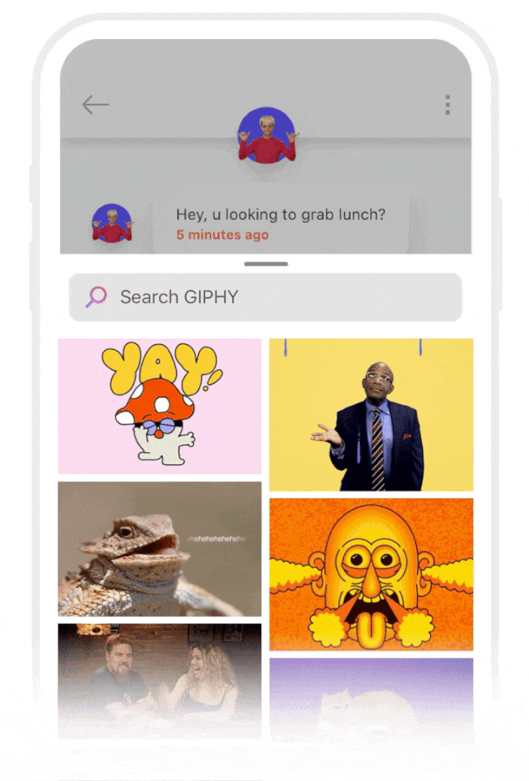

  

# GIPHY SDK for iOS

The fastest and easiest way to bring the full GIPHY experience directly to your app is with the GIPHY SDK. Built with developers and product designers in mind, the GIPHY SDK is a top-to-bottom solution for all things GIF in your app. This includes interfacing with GIPHY API, fetching and caching assets, and displaying GIFs and Stickers on screen in customizable UI templates.

### [Get Started](Docs.md)
