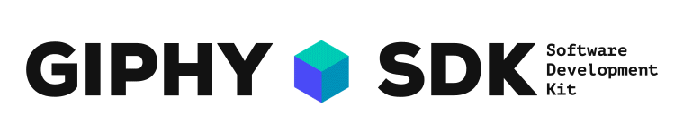

# The Giphy SDK for iOS

The GIPHY SDK is the fastest and smartest way to bring GIFs, Stickers and intuitive design into your app. In a matter of just a few hours, you can employ the GIPHY SDK to give your users a first-class GIPHY experience and increase engagement by up to 5%.

## Overview

This includes interfacing with the GIPHY API, fetching and caching assets, and displaying GIFs and Stickers on screen in customizable UI templates.

With billions of requests a day, it’s safe to say GIPHY knows GIFs. We’re excited to share our best in class tools with you so your users can have the best GIF experience there is. With the GIPHY SDK you can add the same features your users already enjoy on Facebook, Slack, Instagram and more in a matter of hours instead of weeks.

### [Get Started](Docs.md) 

