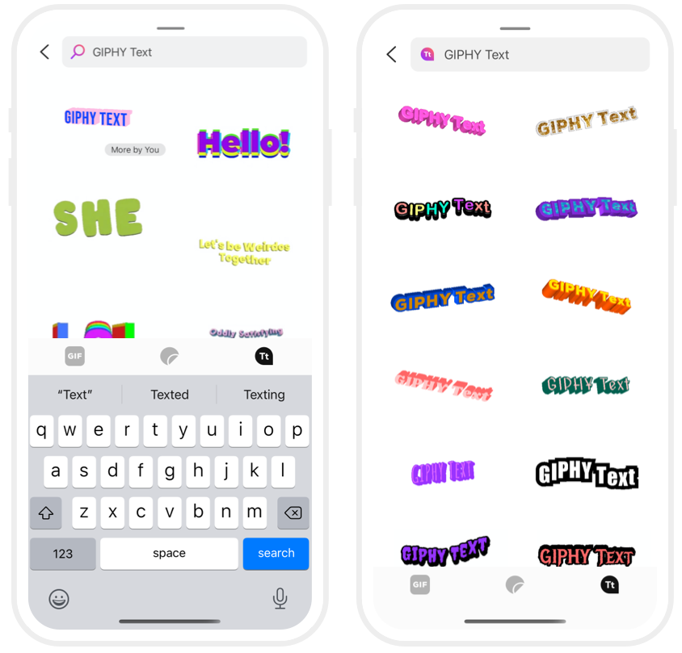

## GIPHY Animated Text Creation 


### Dynamic Text Feature 

This new service _creates_ animated text results for search queries where there are no matching results in GIPHY's library. These results are returned in a number of different animation styles giving your users a variety of options to best express themselves.  
 
### Requirements

- GIPHY SDK v2.0.5 (or above)  
- To access this feature, you'll need to [create a new SDK Key](https://developers.giphy.com/dashboard/?create=true) 
- This feature isn't as 'plug-and-play' as the other features of the SDK. Some additional setup and logic is required to properly offer it in your app. 

### Enabling Dynamic Text in the GiphyViewController


Ensure that the  `.text` `GPHContentType` is included in your `mediaTypeConfig` array. 
```
giphyViewController.mediaTypeConfig = [.gifs, .stickers, .text]
```

Enable the GIPHY Text creation experience in the `GiphyViewController` by setting the `enableDynamicText` flag to true:
```
giphyViewController.enableDynamicText = true 
``` 

### New GPHMedia property: isDynamic

The `isDynamic` property of `GPHMedia` signifies animated text assets that are _dynamically generated_ based on user input and are not indexed in the GIPHY Library. 

As a result, the `id` property of  dynamic media does not represent a normal GIPHY  `id`. Properties and operations such as `gifByID` will not work properly for them. 

For media that `isDynamic`, it is necessary to send or store the asset url, rather than just the media `id`. It is not possible to fetch the image assets from the `id`.  
```
if media.isDynamic {  // handle accordingly }
``` 

### GPHContent.animate (for use with `GiphyGridController`)

This feature is exposed as an additional `GPHContent` (`.animate`) constructor analogous to the existing  [`.search` and `.trending` constructors](https://github.com/Giphy/giphy-ios-sdk-ui-example/blob/master/Docs.md#giphygridcontroller-gphcontent)
```
let trending = GPHContent.trending(mediaType: .sticker)  
let search = GPHContent.search(withQuery: "hello", mediaType: .gif, language: .english)

// new: 
let animatedText = GPHContent.animate("hey what up! hope this all makes sense.") 
``` 

When populating the `GiphyGridController` with dynamic text, provide a visual indicator to clarify to the user that they are in a _creation_ context as opposed to a _search_ context.

### Renditions

We will only return GIF & WebP files for dynamic text. These are renditions available: `original`, `fixed_width`, `fixed_width_downsampled`, `fixed_width_small`, `preview_gif`, `preview_webp`.  
  
